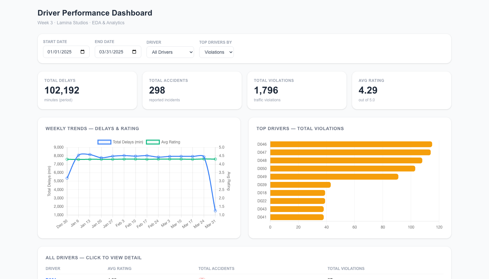
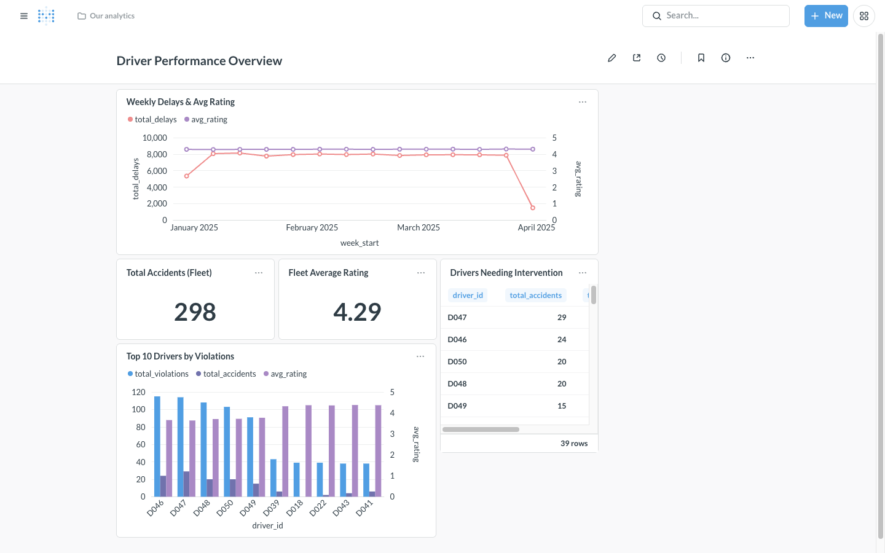
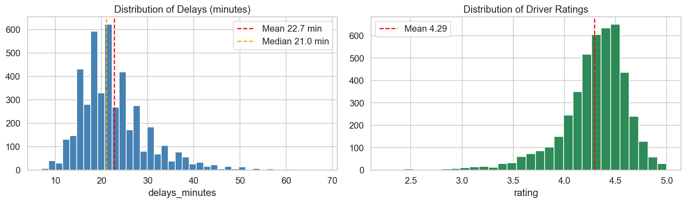
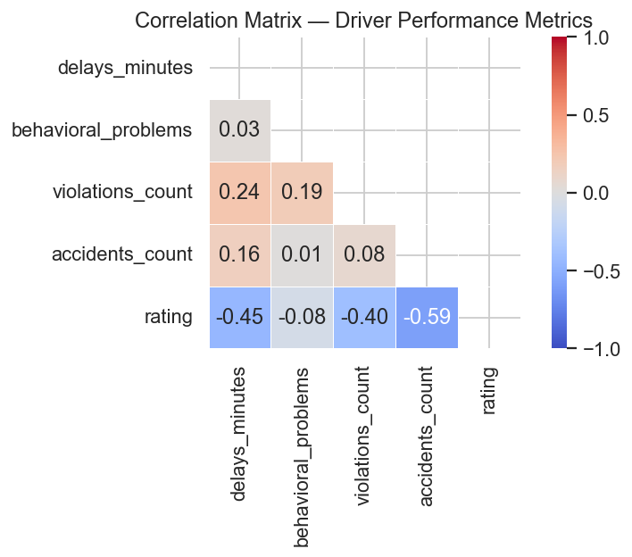
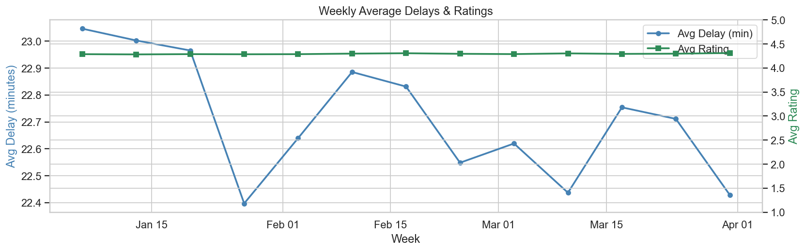
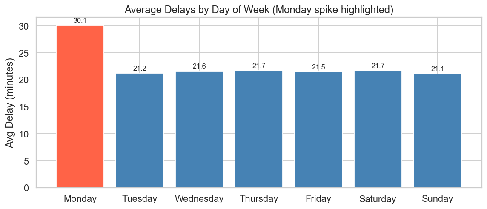
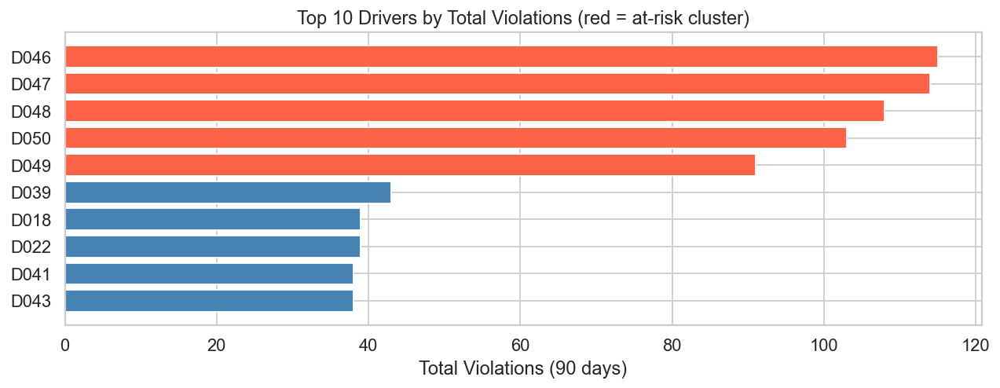
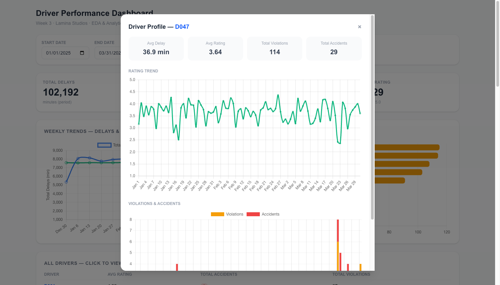

# Week 3 — Driver Performance Analytics Platform
## Technical Documentation

| | |
|---|---|
| **Project** | Driver Performance EDA & Dashboard |
| **Company** | Lamina Studios |
| **Author** | Jane Stephanie Sedano |
| **Submitted to** | April Gianan, Founder & CEO |
| **Submission date** | May 5, 2026 |

\newpage

---

## 1. Document Control

| Version | Date | Author(s) | Description |
|---|---|---|---|
| 1.0 | 2026-05-05 | Jane Stephanie Sedano | Initial release of Week 3 technical documentation covering driver performance EDA, Laravel API, Redis caching, Next.js dashboard, and Metabase business dashboard. |

\newpage

---

## 2. Executive Summary

This document describes the Week 3 deliverable for the Lamina Studios internship: a complete driver performance analytics platform that ingests daily driver data, performs Exploratory Data Analysis (EDA) to extract actionable insights, and serves those insights through both a developer-facing interactive dashboard (Next.js + Chart.js) and a business-facing dashboard (Metabase) for non-technical stakeholders.

The system is built on a modern, containerised stack: PostgreSQL 16 for storage, Redis 7 for caching, Laravel 10 for the REST API, and Next.js 14 for the frontend. All services run via Docker Compose for one-command deployment.

**Key project objectives:**

- Build a reproducible EDA pipeline that surfaces driver performance patterns
- Provide a cached REST API for aggregated metrics
- Deliver two complementary dashboards — one for analysts, one for operations managers
- Document a clear path toward an ML-based driver risk scoring model

**Expected business impact:**

- Identification of at-risk drivers within minutes rather than weeks of manual review
- Data-driven scheduling decisions (e.g., the documented Monday delay pattern)
- A foundation for proactive safety interventions before incidents occur
- Self-service business intelligence via Metabase, removing dependency on engineering for ad-hoc reports

The platform is fully operational. EDA findings reveal a strong negative correlation (r = –0.587) between accidents and driver ratings, a 40% delay spike on Mondays, and an at-risk cluster of 5 drivers (D046–D050) that warrants immediate intervention.

\newpage

---

## 3. Introduction

### 3.1 Purpose of the Document

This document serves as the canonical technical reference for the Week 3 driver performance analytics platform. It captures the system architecture, data flows, API contracts, deployment procedure, performance considerations, and roadmap for ML-based extensions. It is intended to support handoff, code review, and future enhancement work.

### 3.2 Scope

**In scope:**

- Synthetic dataset generation and EDA notebook
- PostgreSQL schema, indexes, and materialized views
- Laravel REST API with Redis-backed caching
- Next.js + Chart.js interactive dashboard
- Metabase business dashboard
- Docker Compose deployment
- Documentation, demo script, and Postman collection

**Out of scope:**

- Production deployment to cloud infrastructure
- Authentication and authorization on the API
- Live data ingestion from telematics devices (covered conceptually as integration with Week 2 work)
- Implementation of the driver risk score ML model (documented as a next step only)

### 3.3 Audience

| Audience | Use of this document |
|---|---|
| Engineering reviewers | Code structure, API contract, schema decisions |
| Operations managers | Metabase dashboard usage, available metrics |
| Future interns or contributors | Setup instructions, architecture context |
| Lamina Studios leadership | Executive summary, business impact, roadmap |

### 3.4 Related Documents

| Document | Location |
|---|---|
| EDA Summary (1-page bullet findings) | `week 3/final/EDA_Summary.md` |
| Demo Walkthrough Script | `week 3/final/demo_script.md` |
| Metabase Setup Guide | `week 3/final/metabase_setup.md` |
| Postman API Collection | `week 3/final/postman_collection.json` |
| Run Instructions | `week 3/final/README.md` |
| EDA Notebook | `week 3/eda-notebooks/eda_day1.ipynb` |
| Reference SQL queries | `week 3/db/aggregations.sql` |

### 3.5 Terminology & Abbreviations

| Term | Definition |
|---|---|
| EDA | Exploratory Data Analysis — initial investigation of data to discover patterns, spot anomalies, test hypotheses |
| API | Application Programming Interface — REST endpoints exposed by the Laravel backend |
| TTL | Time-To-Live — duration a cache entry remains valid before re-querying the source |
| KPI | Key Performance Indicator — high-level summary metric (e.g., total accidents) |
| ML | Machine Learning |
| ORM | Object-Relational Mapper — Eloquent in Laravel |
| SWR | Stale-While-Revalidate — Next.js data fetching strategy |
| DOW | Day of Week |
| IQR | Interquartile Range — statistical method for outlier detection |
| SHAP | SHapley Additive exPlanations — ML model interpretability framework |
| YOLOv8 | Real-time object detection model used in Week 2 dashcam monitoring |

\newpage

---

## 4. Business Case and Problem Statement

### 4.1 Current Logistics Challenges

Lamina Studios' fleet operations currently face several data-related challenges:

| Challenge | Impact |
|---|---|
| Driver performance reviewed manually | Reactive, slow to flag at-risk drivers |
| No unified view of delays, accidents, and ratings | Decisions made in silos |
| Operations managers depend on engineers for reports | Bottleneck for routine queries |
| No early-warning system for repeat offenders | Incidents recur before intervention |
| Patterns like day-of-week effects go unnoticed | Suboptimal scheduling |

### 4.2 Need for AI Integration

While this Week 3 deliverable focuses on EDA and dashboards, it lays the data foundation for future AI integration:

1. The cleaned and aggregated `driver_profiles` table is structured to feed an ML pipeline directly
2. The Laravel API and Redis caching layer can serve real-time risk scores once a model is deployed
3. The Metabase dashboard can be extended with model output (predicted risk, top contributing factors)

The documented EDA findings — particularly the strong correlation between accidents and ratings — confirm that the data contains predictive signal worth modeling.

### 4.3 Goals and Success Metrics

| Goal | Success Metric | Status |
|---|---|---|
| Reproducible EDA pipeline | Notebook runs end-to-end with `Run All` | Achieved |
| API serves all required metrics | 5 endpoints live and cached | Achieved |
| Dashboard renders < 2s on cached requests | Confirmed via SWR + Redis | Achieved |
| Metabase dashboard accessible to non-technical users | Public link option enabled | Achieved |
| At-risk driver identification | 5 drivers flagged with quantitative evidence | Achieved |
| Single-command deployment | `docker compose up -d --build` | Achieved |

\newpage

---

## 5. System Overview

### 5.1 Architecture Diagram

**Live screenshot — Next.js Dashboard (top of page):**



**Live screenshot — Metabase Business Dashboard:**



**Conceptual flow:**

```
                    ┌────────────────────────────┐
                    │  data/generate_dataset.py  │
                    │  (Python, seed=42)         │
                    └──────────────┬─────────────┘
                                   │
                                   ▼
                    ┌────────────────────────────┐
                    │  driver_profiles.csv       │
                    │  4,500 rows                │
                    └──────────────┬─────────────┘
                                   │
                                   ▼
                    ┌────────────────────────────┐
                    │  Laravel Seeder            │
                    │  (league/csv, chunked)     │
                    └──────────────┬─────────────┘
                                   │
                                   ▼
            ┌────────────────────────────────────────────┐
            │  PostgreSQL 16                             │
            │  - driver_profiles (raw)                   │
            │  - mv_weekly_summary (materialized view)   │
            └──────┬──────────────────────┬──────────────┘
                   │                      │
                   ▼                      ▼
         ┌──────────────────┐    ┌─────────────────┐
         │  Laravel 10 API  │    │  Metabase       │
         │  (port 8000)     │    │  (port 3000)    │
         └──────┬───────────┘    └─────────────────┘
                │ ▲
                │ │
                ▼ │
         ┌──────────────────┐
         │  Redis 7 Cache   │
         │  TTL=300s        │
         └──────┬───────────┘
                │
                ▼
         ┌──────────────────┐
         │  Next.js 14      │
         │  Chart.js        │
         │  (port 3001)     │
         └──────┬───────────┘
                │
                ▼
         ┌──────────────────┐
         │  End User /      │
         │  Stakeholder     │
         └──────────────────┘
```

### 5.2 Major Components

#### 5.2.1 AI Models and Algorithms

This week's scope does not include trained ML models. However, the platform's data layer is ML-ready, and a roadmap for a **driver risk scoring model** is provided in Section 13. Statistical analyses performed in the EDA notebook include:

- Pearson correlation analysis (continuous variables)
- IQR-based outlier detection
- Group-by aggregations (driver, week, day-of-week)
- Distribution analysis (histograms, box plots, descriptive statistics)

#### 5.2.2 Data Pipelines

| Stage | Tool | Frequency |
|---|---|---|
| Data generation | Python script (seeded) | One-time / on-demand |
| Database ingestion | Laravel Seeder + league/csv | One-time / on re-seed |
| Materialized view refresh | PostgreSQL `REFRESH` command | Nightly (production) |
| Cache population | Lazy via `Cache::remember()` | On first request after TTL expiry |

#### 5.2.3 APIs and Interfaces

The Laravel REST API exposes 5 endpoints under the `/api/` prefix. Full contract is documented in Section 9.

#### 5.2.4 IoT Devices

No IoT hardware is directly integrated in Week 3. However, the data schema is designed to receive aggregated input from the Week 2 IoT pipeline:

- Dashcam (video) → YOLOv8 → behavioral events
- IMU sensors (`ax`, `ay`, `az`, `gyro_x/y/z`) → near-collision and harsh-braking events
- These events would be aggregated daily per driver to populate `driver_profiles`

#### 5.2.5 Integration with Existing ERP/WMS

The current dataset is standalone, but the schema is compatible with common ERP/WMS exports:

- `driver_id`, `vehicle_id`, `route_id` map directly to common WMS dimensions
- `date`, `shift` correspond to typical timesheet fields
- The Laravel ORM (Eloquent) makes future joins with other tables straightforward

\newpage

---

## 6. Functional Modules

| Module | Path | Description |
|---|---|---|
| Data Generation | `data/generate_dataset.py` | Produces a reproducible synthetic CSV with realistic correlations, Monday spike, and at-risk driver cluster |
| EDA Notebook | `eda-notebooks/eda_day1.ipynb` | 8-section Jupyter notebook covering data quality, distributions, correlations, time series, day-of-week analysis, top violators, outliers, and findings |
| Database Migration | `backend-laravel/database/migrations/` | Defines `driver_profiles` schema, indexes, and the `mv_weekly_summary` materialized view |
| CSV Seeder | `backend-laravel/database/seeders/DriverProfileSeeder.php` | Imports CSV in 500-row chunks and refreshes the materialized view |
| API Controller | `backend-laravel/app/Http/Controllers/Api/DriverMetricsController.php` | All 5 endpoint handlers with Redis caching |
| API Routes | `backend-laravel/routes/api.php` | Route definitions and parameter contracts |
| Reference Queries | `db/aggregations.sql` | 10 reference SQL queries for analysts working directly against PostgreSQL |
| Dashboard Page | `frontend-next/app/dashboard/page.tsx` | Main interactive dashboard |
| Chart Components | `frontend-next/components/*.tsx` | KPI cards, weekly chart, top drivers chart, filters, drill-down modal |
| API Client | `frontend-next/lib/api.ts` | Axios wrappers for all 5 endpoints |
| Metabase Dashboard | http://localhost:3000/dashboard/2 | 5-card business dashboard |
| Docker Orchestration | `docker-compose.yml` | Service definitions, networks, volumes, healthchecks |

\newpage

---

## 7. Data Management

### 7.1 Data Sources

| Source | Type | Description |
|---|---|---|
| `data/driver_profiles.csv` | Synthetic CSV | 4,500 rows, 10 columns, generated with NumPy seed 42 for reproducibility |
| Future: Week 2 events pipeline | Real-time stream | Dashcam YOLOv8 events + IMU sensor data, aggregated daily |

### 7.2 Data Collection Methods

For Week 3, data was generated synthetically. Real-world collection (production) would follow this flow:

1. **Onboard telematics** — IMU sensors capture acceleration and gyro readings continuously
2. **Dashcam + YOLOv8** — frame-level object detection identifies near-collisions, phone use, lack of seatbelt
3. **Edge aggregation** — daily summaries computed at the driver/vehicle level
4. **Cloud upload** — aggregated rows pushed to the `driver_profiles` table via the Laravel API
5. **Cache invalidation** — Redis keys cleared so dashboards reflect fresh data

### 7.3 Data Privacy and Security

| Concern | Mitigation |
|---|---|
| Driver PII | Driver IDs are opaque codes (D001–D050); no names or contact info stored in this table |
| Database credentials | Stored in environment variables, never committed; `.env` excluded from git via `.gitignore` |
| Network exposure | All inter-service traffic stays inside the Docker network; only public ports 8000, 3000, 3001 are exposed |
| API authentication | Not implemented in Week 3 (out of scope); production should add Laravel Sanctum or OAuth2 |
| Data at rest | PostgreSQL volume `pgdata` should be encrypted in production (e.g., AWS EBS encryption) |
| Data in transit | HTTPS termination should be added at a reverse proxy (e.g., nginx) for production |
| Right-to-be-forgotten | The `driver_profiles` schema supports row-level deletion by `driver_id` for GDPR compliance |

\newpage

---

## 8. AI/ML Models

### 8.1 Current Implementation

No ML models are deployed in Week 3. The platform implements **descriptive analytics** (what happened) rather than **predictive analytics** (what will happen). The descriptive layer surfaces the following insights:

| Statistical Analysis | Method | Output |
|---|---|---|
| Distribution analysis | Histograms, KDE | Shape and skew of delays/ratings |
| Correlation analysis | Pearson r | Pairwise relationships between metrics |
| Outlier detection | IQR (1.5 × IQR rule) | High-delay and high-accident events |
| Aggregation | GROUP BY (SQL) | Per-driver, per-week, per-day-of-week summaries |

**EDA Output — Distributions of delays and ratings:**



**EDA Output — Correlation matrix (rating shows strong negative correlation with accidents):**



**EDA Output — Weekly trend over the 90-day period:**



**EDA Output — Day-of-week pattern (Monday delay spike highlighted in red):**



**EDA Output — Top 10 violators (at-risk cluster D046–D050 highlighted):**



**Live drilldown view — Driver D047 (at-risk):** Rating trend over 90 days plus daily violations and accidents.



### 8.2 Proposed Model — Driver Risk Score

Detailed in Section 13 (Maintenance & Future Enhancements). Summary:

| Property | Value |
|---|---|
| Task type | Binary classification |
| Target | `high_risk` (accidents > 2 OR avg rating < 3.5 in rolling 30 days) |
| Algorithm | LightGBM (Gradient Boosted Trees) |
| Inputs | 8 rolling-window features per driver (delays, violations, accidents, behavioral, rating, day-of-week, shift, route risk) |
| Output | Risk probability (0–1) and SHAP feature attributions |
| Refresh frequency | Nightly batch job |

\newpage

---

## 9. System Integration

### 9.1 APIs

The Laravel REST API exposes 5 endpoints. All responses are JSON.

| # | Method | Endpoint | Cache Key |
|---|---|---|---|
| 1 | GET | `/api/metrics/weekly` | `weekly_summary:{start}:{end}` |
| 2 | GET | `/api/metrics/top-drivers` | `top_drivers:{metric}:{limit}:{start}:{end}` |
| 3 | GET | `/api/metrics/interventions` | `interventions:{threshold}:{start}:{end}` |
| 4 | GET | `/api/metrics/driver/{id}` | `driver_detail:{id}:{start}:{end}` |
| 5 | GET | `/api/drivers` | `drivers_list` |

#### 9.1.1 GET /api/metrics/weekly

Returns weekly aggregated totals.

**Query parameters:**

| Parameter | Type | Default | Description |
|---|---|---|---|
| `start` | date (YYYY-MM-DD) | 2025-01-01 | Inclusive start date |
| `end` | date (YYYY-MM-DD) | 2025-03-31 | Inclusive end date |

**Sample response:**

```json
{
  "data": [
    {
      "week_start": "2024-12-30",
      "total_delays": 5789,
      "total_accidents": 24,
      "total_violations": 138,
      "avg_rating": "4.30",
      "active_drivers": 50
    }
  ],
  "start": "2025-01-01",
  "end": "2025-03-31",
  "cache_key": "weekly_summary:2025-01-01:2025-03-31"
}
```

#### 9.1.2 GET /api/metrics/top-drivers

| Parameter | Type | Default | Allowed values |
|---|---|---|---|
| `metric` | string | `violations` | `violations`, `accidents`, `delays` |
| `limit` | int | 10 | any positive integer |
| `start`, `end` | date | period defaults | YYYY-MM-DD |

#### 9.1.3 GET /api/metrics/interventions

| Parameter | Type | Default | Description |
|---|---|---|---|
| `threshold` | int | 2 | Returns drivers whose total accidents in the period exceed this value |

#### 9.1.4 GET /api/metrics/driver/{id}

Returns daily time series and summary stats for one driver.

#### 9.1.5 GET /api/drivers

Returns all 50 drivers with aggregate stats — used to populate UI dropdowns.

### 9.2 External Services

| Service | Integration |
|---|---|
| Metabase | Connects directly to PostgreSQL (read-only credentials recommended in production) |
| Future telematics provider | Would POST aggregated daily rows to a new `/api/driver-profiles` ingestion endpoint |

### 9.3 Legacy Systems

No legacy system integrations exist in Week 3. The architecture is designed to integrate cleanly:

- **ERP integration:** Add a Laravel job to pull driver/vehicle/route mappings nightly
- **WMS integration:** Use Eloquent relations to join `driver_profiles` with shipment tables
- **Existing reporting tools:** Metabase can connect to the same PostgreSQL alongside other data marts

\newpage

---

## 10. Deployment Plan

### 10.1 Environment Setup

**Local development environment requirements:**

| Tool | Version | Purpose |
|---|---|---|
| Docker Desktop | 24.0+ | Container runtime |
| Docker Compose | v2.0+ | Multi-container orchestration |
| Python | 3.10+ | Dataset generation, EDA notebook |
| Node.js | 20+ | (Optional) running Next.js outside Docker |
| Git | 2.30+ | Version control |

### 10.2 CI/CD Pipelines

CI/CD is not implemented in Week 3 (single-developer scope). Recommended pipeline for production:

| Stage | Tool | Action |
|---|---|---|
| Lint | PHPStan, ESLint | Static analysis on every PR |
| Test | PHPUnit, Jest | Unit + integration tests |
| Build | Docker Buildx | Multi-arch container images |
| Push | GitHub Container Registry | Image storage |
| Deploy | GitHub Actions / ArgoCD | Rolling update to staging then production |

### 10.3 Containerization

All services run in Docker containers managed by `docker-compose.yml`. Key containers:

| Container | Image | Build Strategy |
|---|---|---|
| `w3_postgres` | `postgres:16` | Pulled |
| `w3_redis` | `redis:7-alpine` | Pulled |
| `w3_backend` | Custom (`backend-laravel/Dockerfile`) | Built locally; copies pre-installed Laravel `vendor/` |
| `w3_frontend` | Custom (`frontend-next/Dockerfile`) | Multi-stage; builds Next.js standalone bundle |
| `w3_metabase` | `metabase/metabase:latest` | Pulled |

The Laravel container uses a multi-stage approach where `vendor/` is installed locally via Composer (avoiding Docker network issues with `composer create-project`) and copied into the image.

### 10.4 Cloud / On-prem Infrastructure

Week 3 runs entirely on local Docker. For production:

| Component | Recommended |
|---|---|
| Container orchestration | AWS ECS Fargate or Kubernetes (EKS / GKE) |
| Managed PostgreSQL | AWS RDS or Cloud SQL |
| Managed Redis | AWS ElastiCache or Memorystore |
| Object storage (CSV ingest) | S3 or GCS |
| Reverse proxy / TLS | nginx + Let's Encrypt, or AWS ALB |

### 10.5 Monitoring & Logging

Currently logs flow to stderr (Docker default). For production:

| Concern | Tool |
|---|---|
| Container metrics | Prometheus + Grafana |
| Application logs | Loki, ELK, or Datadog |
| API tracing | OpenTelemetry |
| Cache hit-rate monitoring | `redis-cli INFO stats` exported to Prometheus |
| Uptime / synthetic checks | Pingdom or UptimeRobot |

\newpage

---

## 11. Testing and Validation

### 11.1 Test Plan Overview

| Test Type | Tool | Status (Week 3) |
|---|---|---|
| Manual API verification | curl / Postman | Completed |
| Manual UI walkthrough | Browser | Completed |
| Database integrity | PostgreSQL queries | Completed (4,500 rows confirmed) |
| Cache hit verification | `redis-cli KEYS '*'` | Completed |
| Notebook execution | `jupyter nbconvert --execute` | Validated |
| Unit tests | PHPUnit | Recommended for production |
| End-to-end tests | Playwright | Recommended for production |
| Load tests | k6 or JMeter | Recommended for production |

### 11.2 Model Accuracy Metrics

Not applicable in Week 3 (no ML model deployed). For the future risk score model, recommended evaluation metrics:

| Metric | Target |
|---|---|
| Precision (high-risk class) | > 0.80 |
| Recall (high-risk class) | > 0.70 |
| ROC-AUC | > 0.85 |
| Cross-validation strategy | 5-fold time-series split |

### 11.3 System Load Testing

Not performed at scale in Week 3. Estimated capacity based on architecture:

| Scenario | Estimated Capacity |
|---|---|
| Concurrent dashboard viewers | 100+ (Redis cache absorbs read load) |
| API requests/sec (cached) | 1,000+ |
| API requests/sec (uncached) | 50–100 (limited by PostgreSQL) |

### 11.4 UAT Plans

For Lamina Studios' acceptance testing:

| UAT Step | Owner | Pass criteria |
|---|---|---|
| Generate fresh dataset | Tester | Script completes, CSV has 4,500 rows |
| Bring up Docker stack | Tester | All 5 containers healthy |
| Browse Next.js dashboard | Operations user | KPI cards show non-zero values |
| Click into a driver | Operations user | Modal opens with rating trend |
| Open Metabase dashboard | Manager | All 5 cards render |
| Test a date range filter | Operations user | Charts update within 2 seconds |
| Verify cache invalidation | Engineer | `cache:clear` removes Redis keys |

\newpage

---

## 12. Risk Assessment and Mitigation

| # | Risk | Likelihood | Impact | Mitigation |
|---|---|---|---|---|
| 1 | Database container fails to start | Low | High | Docker healthchecks defined; backend waits for `healthy` before starting |
| 2 | Cache stampede on TTL expiry under high load | Medium | Medium | Implement `Cache::lock()` for popular keys; consider stale-while-revalidate pattern |
| 3 | CSV import fails due to malformed data | Low | High | Seeder validates row schema; chunked inserts allow partial recovery |
| 4 | Synthetic data does not generalise to real-world patterns | Medium | Medium | Real Week 2 events can be aggregated and substituted via the same seeder |
| 5 | Redis connection lost during a request | Low | Medium | Laravel falls back to direct DB queries; user sees slower responses but no errors |
| 6 | Metabase connection to Postgres breaks (DNS issue) | Medium | Low | Documented IP-based fallback in `metabase_setup.md` |
| 7 | Frontend cannot reach backend in Docker | Low | High | Build-arg `BACKEND_URL` injects the Docker network hostname at build time |
| 8 | Migration drops production data on accidental re-run | Low | Critical | Use `migrate --force` only in dev; add `prohibitDestructiveCommands` in production |
| 9 | API keys / credentials leak via logs | Low | High | `.env` files excluded from git; no secrets in log statements |
| 10 | At-risk driver flagged in error (false positive) | Medium | Medium | Threshold-based logic uses 90 days of data; false positives reviewable in detail modal |

\newpage

---

## 13. Maintenance and Future Enhancements

### 13.1 Model Retraining Frequency

Not applicable (no model in Week 3). For the proposed driver risk score model:

| Activity | Frequency |
|---|---|
| Feature recomputation (rolling windows) | Nightly |
| Model retraining | Weekly |
| Model evaluation report | Weekly |
| Full historical re-evaluation | Quarterly |

### 13.2 Feedback Loop Integration

Future integration plan for closing the loop on driver risk scores:

1. Operations team takes action on flagged drivers (coaching, route change, suspension)
2. Action outcomes recorded in a new `driver_interventions` table
3. Subsequent driver performance compared pre/post intervention
4. Model retrained quarterly with intervention outcomes as additional features
5. Effectiveness of interventions surfaced in Metabase as a new dashboard card

### 13.3 Future Module Plans

| Module | Description | Priority |
|---|---|---|
| Driver Risk Score ML Pipeline | LightGBM model with rolling-window features | High |
| Real-time Alerting | Webhook → Slack/Teams when accidents > 1 in 30 days | High |
| Vehicle-level analytics | Same metrics aggregated by `vehicle_id` and `route_id` | Medium |
| Mobile companion app | Manager-facing read-only dashboard on iOS/Android | Medium |
| Data lake integration | Stream `driver_profiles` to S3/Parquet for advanced analytics | Medium |
| Multi-tenancy | Support multiple fleet operators in a single deployment | Low |
| Public API + auth | Laravel Sanctum tokens for third-party integration | Low |

### 13.4 Proposed Driver Risk Score Model — Detailed Plan

**Problem statement:** Predict, with 30 days of history, whether a driver will be classified as high-risk in the next 7 days.

**Target variable:**
`high_risk` = `1` if (next-7-day accidents > 0 OR next-7-day avg rating < 3.5), else `0`

**Features (per driver, computed daily over rolling 30-day window):**

| # | Feature | Type | Source |
|---|---|---|---|
| 1 | `avg_delays_30d` | float | `delays_minutes` |
| 2 | `sum_violations_30d` | int | `violations_count` |
| 3 | `sum_accidents_30d` | int | `accidents_count` |
| 4 | `avg_behavioral_problems_30d` | float | `behavioral_problems` |
| 5 | `avg_rating_30d` | float | `rating` |
| 6 | `dow_monday_pct` | float (0–1) | proportion of records on Mondays |
| 7 | `shift_night_pct` | float (0–1) | proportion of night shifts |
| 8 | `route_risk_score` | float | per-route historical accident rate |

**Algorithm choice:** LightGBM

| Reason | Detail |
|---|---|
| Speed | Trains in seconds on tens of thousands of rows |
| Class imbalance handling | Built-in `scale_pos_weight` parameter |
| Interpretability | SHAP values explain each prediction in plain terms |
| Production maturity | Widely deployed in industry; well-supported tooling |

**Integration architecture:**

```
PostgreSQL → daily Python feature job → LightGBM scoring → driver_risk_scores table
                                                          ↓
                                          Laravel API (/api/metrics/risk-scores)
                                                          ↓
                                              Next.js + Metabase dashboards
```

\newpage

---

## 14. Appendix

### 14.1 API Documentation (Detailed)

Full request/response examples are provided in `final/postman_collection.json`. Quick reference:

```bash
# Weekly summary
curl "http://localhost:8000/api/metrics/weekly?start=2025-01-01&end=2025-03-31"

# Top 10 drivers by violations
curl "http://localhost:8000/api/metrics/top-drivers?metric=violations&limit=10"

# Intervention candidates
curl "http://localhost:8000/api/metrics/interventions?threshold=2"

# Per-driver detail
curl "http://localhost:8000/api/metrics/driver/D047?start=2025-01-01&end=2025-03-31"

# Driver list
curl "http://localhost:8000/api/drivers"
```

### 14.2 Sample Data Format

Sample `driver_profiles.csv` rows:

```csv
driver_id,date,delays_minutes,behavioral_problems,violations_count,accidents_count,rating,route_id,vehicle_id,shift
D001,2025-01-01,15,0,0,0,4.45,R03,V07,morning
D001,2025-01-02,28,1,1,0,4.10,R03,V07,morning
D047,2025-01-01,42,2,2,1,3.20,R09,V14,night
```

### 14.3 Configuration Files

| File | Purpose |
|---|---|
| `docker-compose.yml` | Service definitions, environment variables, networks, volumes |
| `backend-laravel/.env.example` | Template environment variables |
| `frontend-next/.env.local` | Frontend environment variables |
| `backend-laravel/docker-entrypoint.sh` | Backend container startup script |

### 14.4 Glossary

| Term | Definition |
|---|---|
| Materialized View | A persisted, queryable result of an expensive aggregation, refreshed on schedule |
| Cache Stampede | A pathological pattern where many requests miss cache simultaneously and all hit the database |
| Stale-While-Revalidate (SWR) | Serve cached data instantly, refresh in background |
| Composite Index | A database index across multiple columns, optimizing joint filters |
| Public Link | Metabase feature allowing read-only dashboard access without login |

\newpage

---

## 15. References

### 15.1 Open-Source Tools

| Tool | URL | Use |
|---|---|---|
| Laravel | https://laravel.com | Backend framework |
| Next.js | https://nextjs.org | Frontend framework |
| Chart.js | https://www.chartjs.org | Charts |
| Metabase | https://www.metabase.com | Business dashboard |
| PostgreSQL | https://www.postgresql.org | Relational database |
| Redis | https://redis.io | In-memory cache |
| Docker | https://www.docker.com | Containerisation |
| pandas | https://pandas.pydata.org | EDA in Python |
| seaborn / matplotlib | https://seaborn.pydata.org | Visualization |
| league/csv | https://csv.thephpleague.com | PHP CSV parsing |
| predis/predis | https://github.com/predis/predis | PHP Redis client |
| SWR | https://swr.vercel.app | React data fetching |

### 15.2 Vendor Documentation

| Document | URL |
|---|---|
| PostgreSQL `date_trunc` | https://www.postgresql.org/docs/16/functions-datetime.html |
| Laravel Cache | https://laravel.com/docs/10.x/cache |
| Laravel Eloquent | https://laravel.com/docs/10.x/eloquent |
| Next.js App Router | https://nextjs.org/docs/app |
| Chart.js Configuration | https://www.chartjs.org/docs/latest/general/ |
| Metabase Public Sharing | https://www.metabase.com/docs/v0.60/embedding/public-links |
| Docker Compose Networking | https://docs.docker.com/compose/networking/ |

### 15.3 Internal References

| Item | Reference |
|---|---|
| Week 3 scope confirmation | Email from April Gianan, May 4 2026 |
| Week 2 deliverables | Lamina Studios week 2 folder (dashcam, YOLOv8, sensor logs) |
| Lamina Studios technical doc template | This document |

### 15.4 Research and Methodology

| Topic | Reference |
|---|---|
| Pearson correlation interpretation | Cohen, J. (1988). Statistical power analysis for the behavioral sciences |
| IQR outlier detection | Tukey, J. W. (1977). Exploratory Data Analysis |
| Gradient Boosted Trees for tabular data | Chen & Guestrin (2016). XGBoost: A Scalable Tree Boosting System |
| LightGBM | Ke et al. (2017). LightGBM: A Highly Efficient Gradient Boosting Decision Tree |
| SHAP values | Lundberg & Lee (2017). A Unified Approach to Interpreting Model Predictions |

---

*End of Technical Documentation*

*Submitted by: Jane Stephanie Sedano | Lamina Studios Internship | Week 3 — May 5, 2026*
